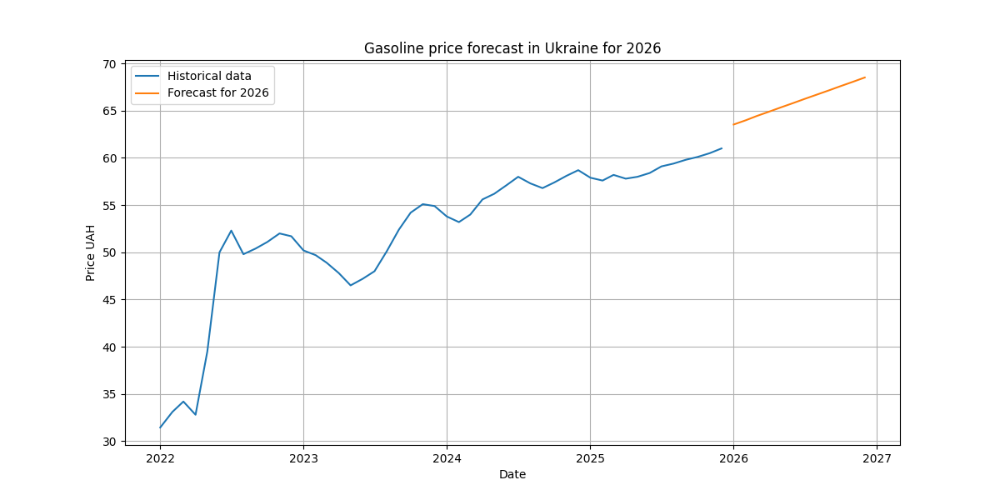

# Gasoline Price Forecast in Ukraine (2026)

## Project Description
This project predicts gasoline prices in Ukraine for 2026 using historical monthly data.

The goal of the project is to demonstrate a simple machine learning pipeline:
- loading data
- data preprocessing
- visualization
- training a model
- forecasting future values

## Technologies Used
- Python
- Pandas
- NumPy
- Matplotlib
- Scikit-learn
- Jupyter Notebook

## Dataset
The dataset contains historical monthly gasoline prices in Ukraine from 2022 to 2025.

Columns:
- `date` — month
- `price_uah` — average gasoline price in UAH

## Model
A **Linear Regression** model was used to detect the trend in gasoline prices over time.

## Result
The model forecasts gasoline prices for each month of 2026 based on historical trends.

The forecast is saved to:

outputs/gasoline_forecast_2026.csv

## Project Structure
  gasoline-forecast-ukraine-2026
  │
  ├── data
  │ └── gasoline_prices_ukraine.csv
  │
  ├── notebooks
  │ └── forecast.ipynb
  │
  ├── outputs
  │ └── gasoline_forecast_2026.csv
  │
  └── README.md

## Author
Pet project for learning **Data Science / Machine Learning with Python**.
